# my-hexagonal-go
$ mkdir -p ./{bin,src,pkg}

protoc --go-grpc_out=internal/adaptors/framework/left/grpc --proto_path=internal/adaptors/framework/left/grpc/proto internal/adaptors/framework/left/grpc/proto/*.proto

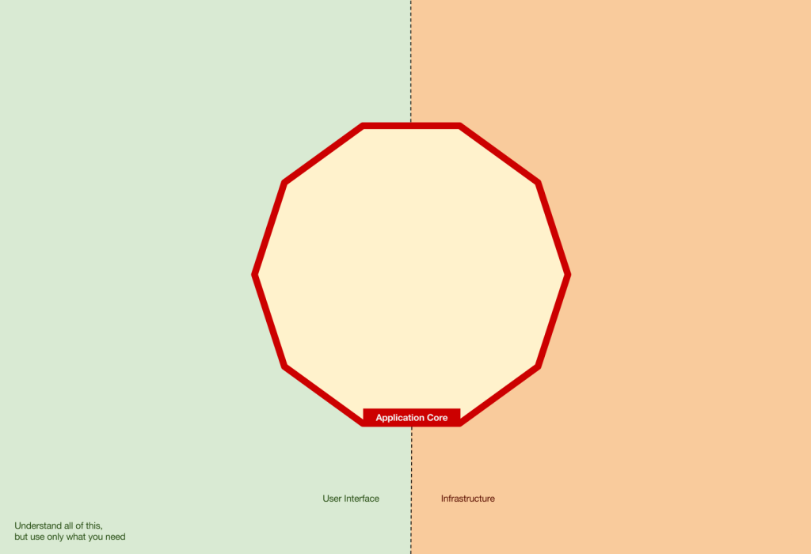
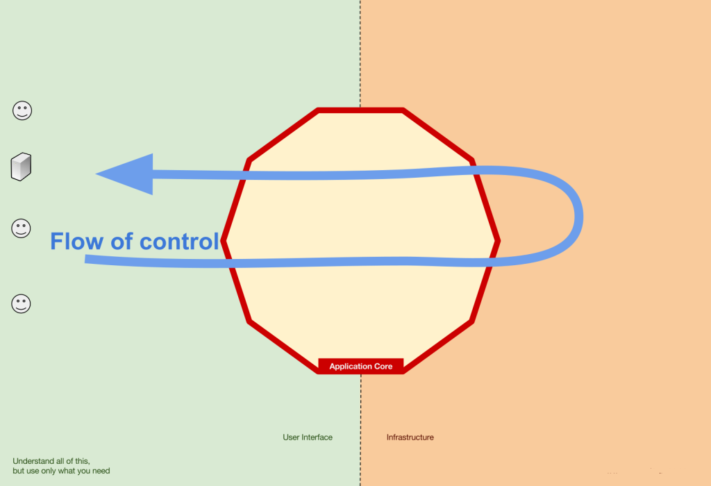
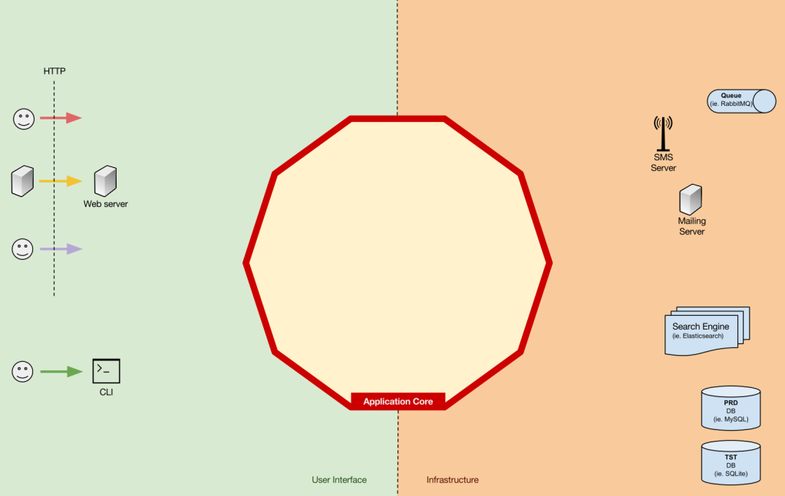
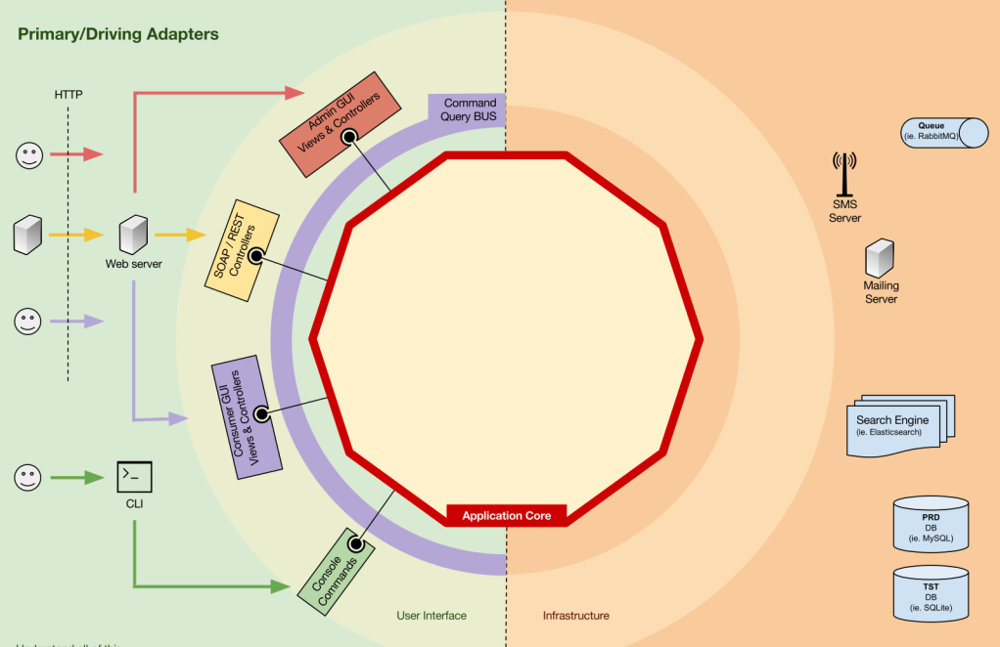
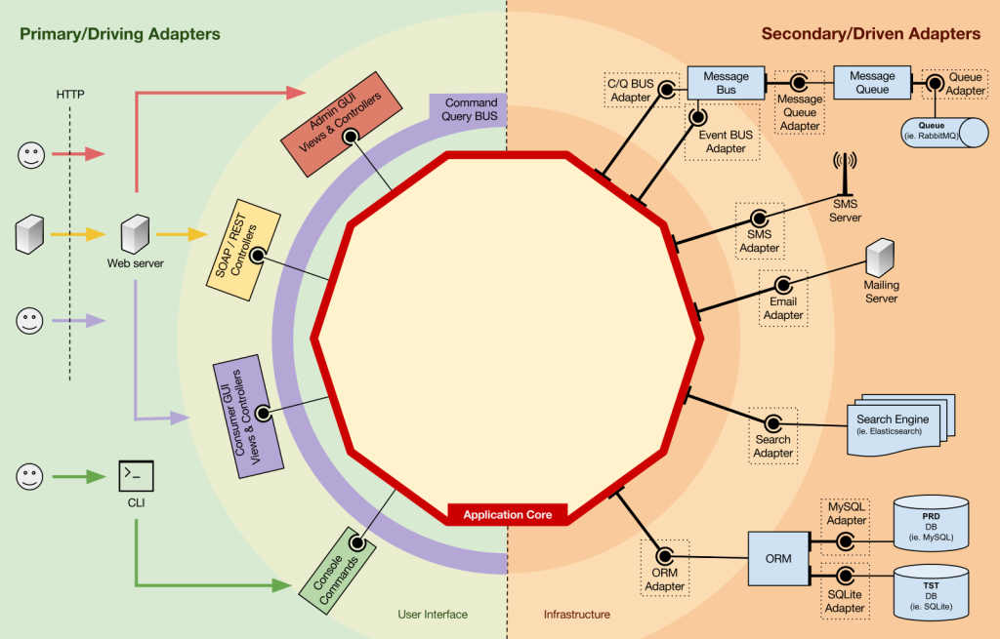
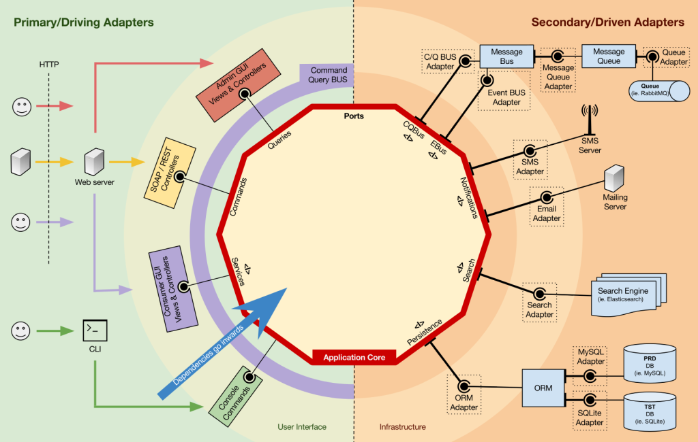
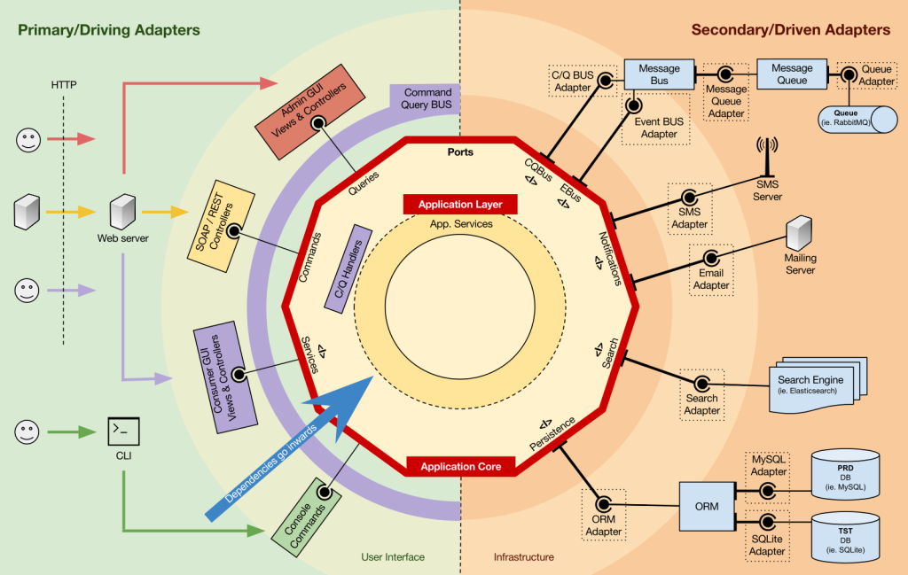
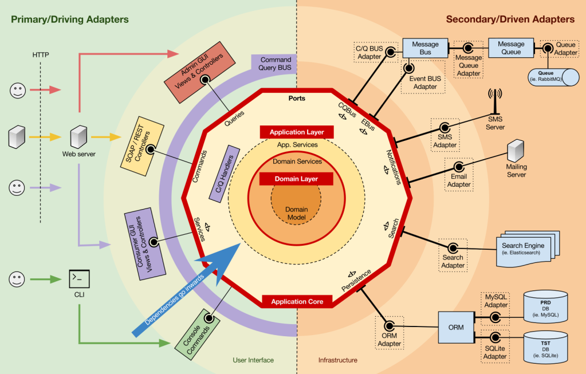

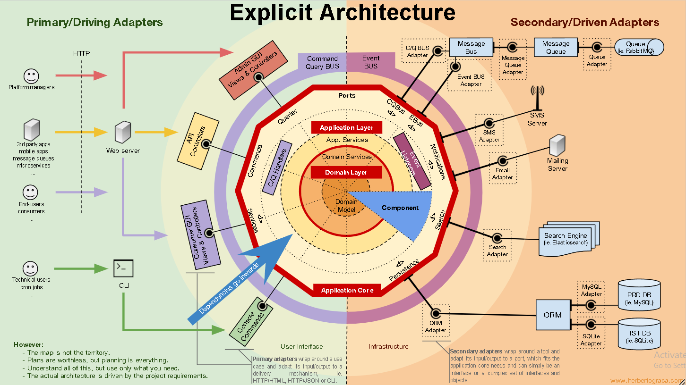
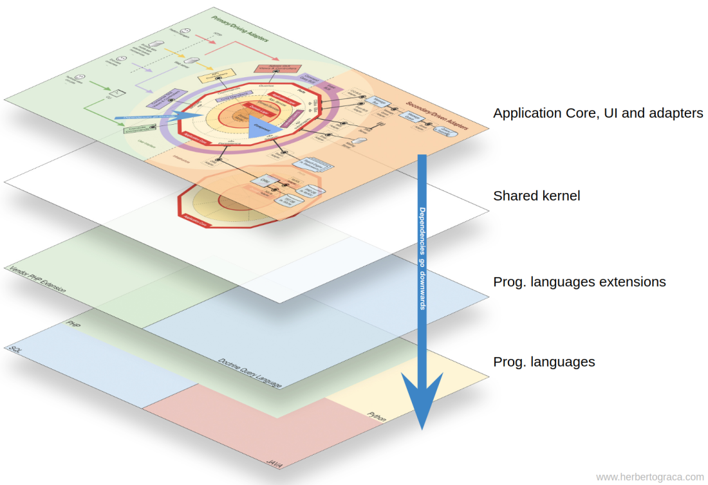
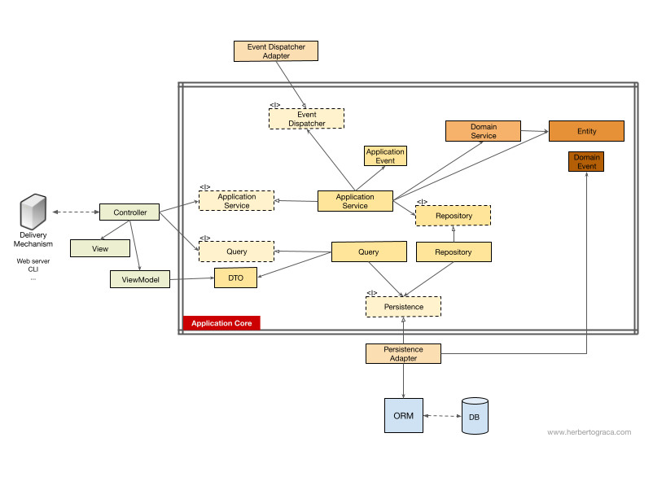

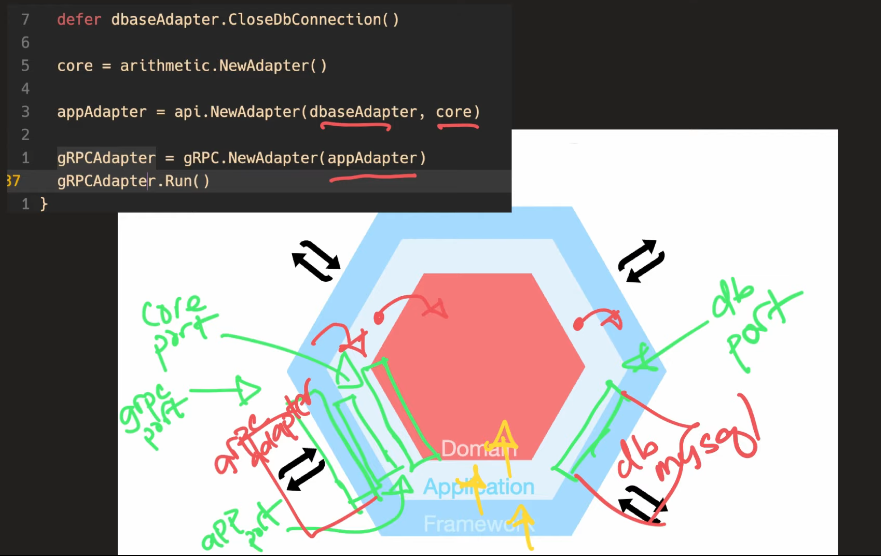
